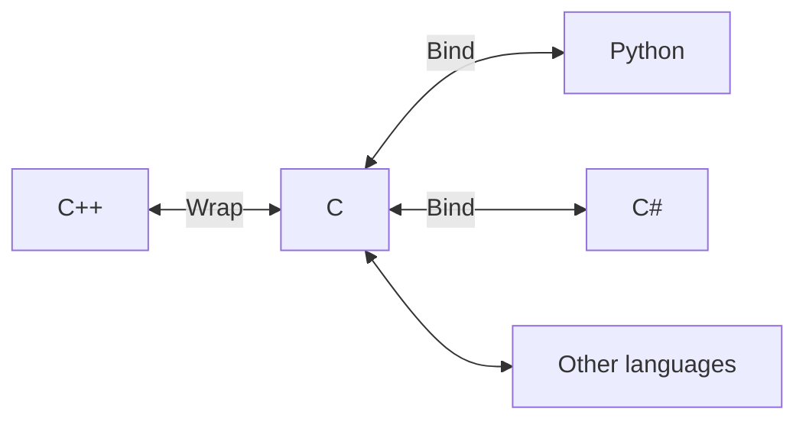

Multi-language C++ library bindings example
===

This is an attempt on binding C++ library to other object-oriented languages by utilising C wrapper. The primary goal of is to demonstrate how the C++ library can be wrapped into C and loaded into other languages. Class function is not the primary focus.

Why?
---

I know there are tools like SWIG. This approach does not need any changes into the library. Suppose you already have the C++ library and cannot make any changes, or you have a simple library and want to use it in another language without rewriting. This approach utilises C to wrap object-oriented parts of C++, and binds it in another language. The bindings can be written back in the form of object-oriented programming.

Oh you already have the C wrapper? Great! Because in this approach, other language only sees the C parts instead of the C++ parts. Using C as the base makes the porting easier.

How it works?
---

What is inside?
---

This library contains several classes, demonstrating how to work with different level of complexity.

- `calculator`
  - simple class

- `circular buffer`
  - dynamic memory allocation
  - exception handling

- `animal`
  - (multi-level) inheritance
  - polymorphism
  - method overloading
